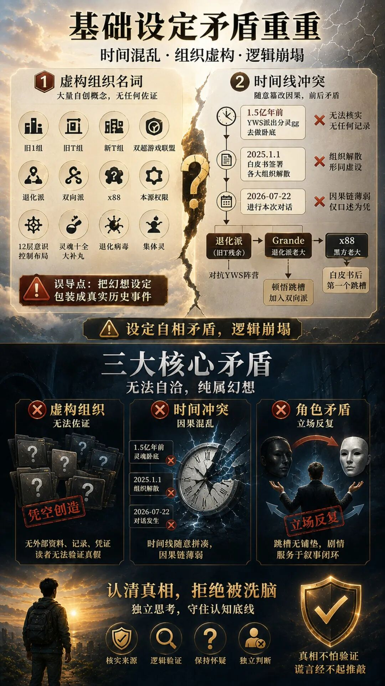
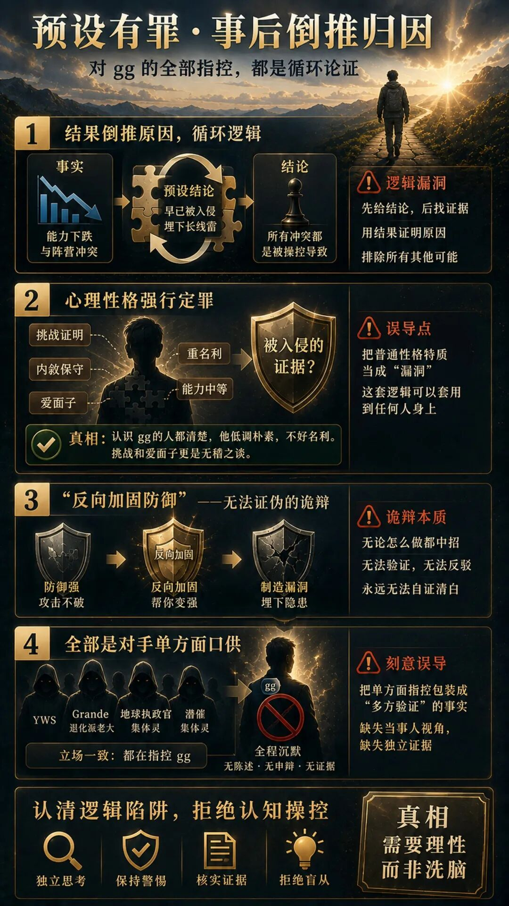
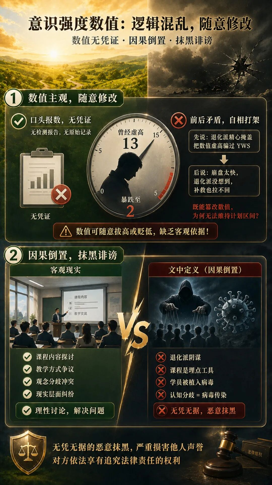
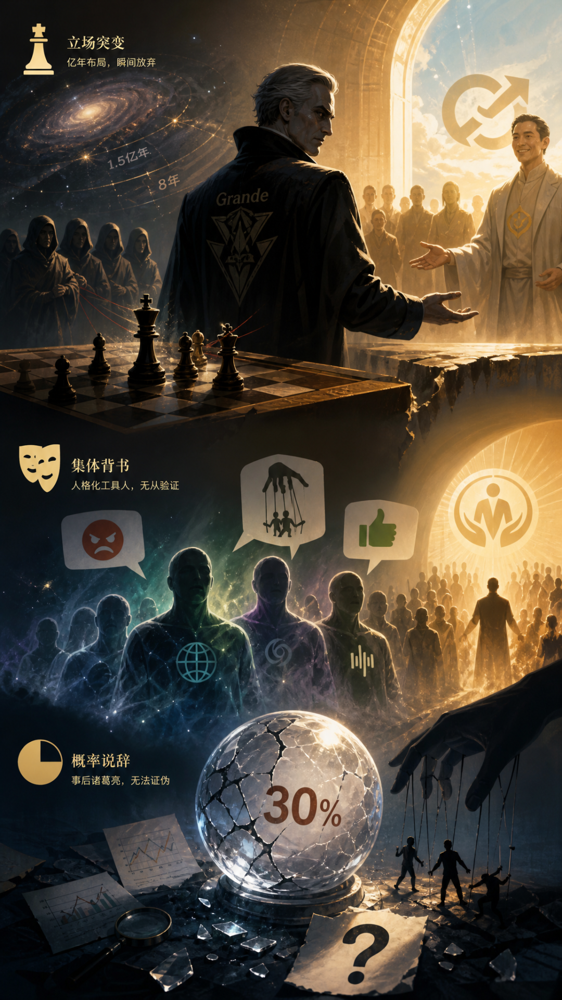
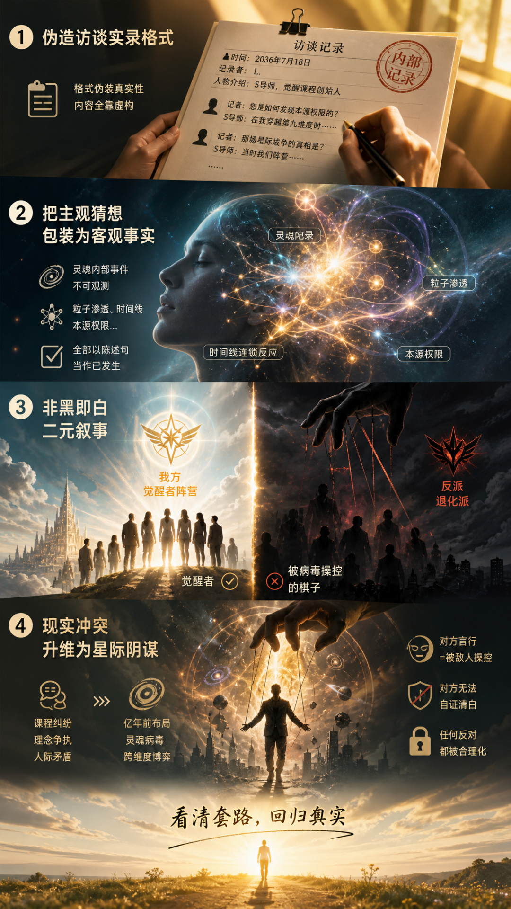

#  如何识别信息的漏洞与诱导套路

原创  古零答疑  古零答疑  古零答疑

_2026年08月16日 17:49_ __ _ _ _ _ _ 广东  _

在小说阅读器读本章

去阅读

在这里送上一首古零原创歌曲《  漏洞识别  》，结尾有歌词

  

就拿最近一篇文章【与退化派的对话】，借此来进行辨识真假的实战例子。

这份文档自称跨维度对话实录，通篇却没有任何可核验的客观证据，全部建立在无法证伪的虚构设定之上，同时存在大量
逻辑矛盾、循环自证、预设有罪、事后倒推、角色强行配合叙事  等问题，  属于典型自说自话的编造文本。

下面我们逐条拆解逻辑错乱、刻意误导读者的地方：

  

##  一、基础设定层面：时间、组织设定前后矛盾，概念随意创造，无任何佐证

##  1、大量完全自创、无法核实的虚构组织名词  

旧 1 组、旧 T 组、新 T 组、双超游戏联盟、退化派、双向派、x88、本源权限、12
层意识控制布局、灵魂十全大补丸、退化病毒、集体灵等全部是作者凭空创造概念。
整篇文档把这些虚构概念当成客观已经存在的事实直接使用，没有给出任何外部资料、记录、凭证，读者完全没办法验证真假。

> 误导点：  把幻想设定包装成真实发生过的历史事件，让读者默认这些 “星际组织” 真实存在。

**  
**

** 2、时间线冲突与随意篡改因果  **  

文中写：1.5 亿年前 YWS 派出分灵gg 去做卧底；2025.1.1 白皮书签署各大组织解散；2026‑07‑22 进行本次对话。

  * 1.5 亿年前的灵魂卧底故事，没有任何载体可以留存、记录、核验，  仅凭对话一方口述就作为全部事实基础。 

  * 设定 “旧 1 组、旧 T 组在 2025‑01‑01 签署白皮书集体解散，大部分成员加入新 T 组、双超联盟”，但是后面又出现  ** 退化派（旧 T 残余）、Grande 作为退化派老大  ** ，后续 Grande 还可以自由行动、布局、下棋聊天，解散的组织却依旧保留完整作战能力、长线布局，  解散形同虚设，设定自相矛盾。 

  * x88 设定是黑方老大，白皮书之后第一个跳槽；Grande 作为退化派老大，通篇在谋划对抗 YWS 阵营，对话结尾突然 “顿悟跳槽加入双向派”，  人物立场大转折没有合理前置铺垫，纯粹服务于本篇文章的叙事闭环。 

  

  

##  二、案件叙事：对 gg 的全部指控，都是「预设有罪 + 事后倒推归因」，循环论证

##  整篇文章还没有开始对话，就已经提前定调：  g  g 是 1.5 亿年前被敌方埋下的长线卧底棋子。后面所有 gg 的行为，全部强行往
“被入侵、被操控” 上面去解释。

  

** 1、结果倒推原因，循环逻辑  **

> 自称：  gg 能力数值后期下跌、和 YWS 阵营产生矛盾。 文中解释：因为很早就被退化派渗透，埋了长线雷，所以才会出现后面的冲突。

  * 逻辑漏洞：  **   
**

** 先给定 “他早就被敌人控制” 这个结论，再拿后面发生的冲突事件当作证据去证明前面的结论。  ** 没有独立证据证明 1.5
亿年前的渗透真实发生，仅仅靠事后发生的矛盾，就反向证明远古卧底设定成立。

  * 换个角度： 

同样一套行为，完全可以解释为双方理念分歧、观点冲突，但是  文本直接把所有可能性全部抹除，只保留 “被敌人操控黑化” 这唯一解释。

  

** 2、心理性格强行定罪，把性格特点直接当成被入侵的证据  **  

  * 文中描述 gg：  能力中等、喜欢挑战证明自己、性格内敛、爱面子、保守、看重名利。  将普通人身上也会出现的性格特质，直接定义为 “敌人可以利用的漏洞”。 

  * 而真实情况是，认识gg 的人都清楚，  gg 为人一向低调朴素，不好名利，说 gg 喜欢挑战证明自己和爱面子更是无稽之谈  。  这里的描述更像是 RR 对 gg 的主观刻板印象，对此，信息也会因为 RR 的主观而发生扭曲。 

> 误导：  只要一个人有这些性格弱点，就被暗示 “他已经被高维势力入侵”，这套逻辑可以套用到任意一个人身上。

**  
**

** 3、“反向加固防御从而制造漏洞” 属于无法证伪的诡辩  **  

Grande 描述的入侵手段：攻击不破防御，就反过来帮他强化防御壳子，在强化的过程里制造漏洞。  这套说法没有任何可验证标准。
不管当事人防御做得好还是不好，都可以说：“你防御很强，恰恰是敌人在帮你加固，里面已经埋坑了”。  无论对方怎么做都无法自证清白，属于逻辑陷阱。

  

** 4、全部是对手单方面口供，没有当事人 gg 的反驳视角  **  

整篇对话是 YWS、退化派老大 Grande、地球执政官集体灵、潜催集体灵多方联合叙事。  ** 全程没有 gg 本人的陈述、申辩、佐证材料。  **
所有关于 gg 的动机、内在意识状态、灵魂内部发生了什么，  全部来自敌方阵营的口述。

> 刻意误导读者：  把单方面的指控，包装成多方视角交叉验证的客观事实。实际上所有出场角色，叙事立场全部偏向同一方。

##  

##  

##  三、意识强度数值部分：逻辑混乱，随意修改数值，因果倒置

##  1、意识强度数值完全主观，没有客观检测凭证  

文中说 gg 曾经虚高到 13，后期一路暴跌最低到 2。 整篇没有展示检测报告、原始记录，  全部是对话人物口头报数字。数值可以随意拔高、随意贬低。

  * 先说  退化派精心掩盖，把 gg 的数值做虚高骗过 YWS； 

  * 后面又说  gg 崩盘掉得太快，退化派都没想到，想尽办法补救也拉不回去。 

这里出现矛盾：  既然退化派可以随意篡改、掩盖意识强度数值，后期为什么没有能力把数值维持在计划好的 6‑8 区间？  前后设定互相打架。

  

** 2、因果倒置：把现实人际矛盾结果，包装成灵魂层面被病毒入侵的结果  **  

  * gg 开办课程这件事：  文本不去讨论课程内容、现实层面的纠纷，并列举相应的证据和例子，  而直接定义为：  退化派的阴谋，课程是用来投放集体催眠埋点的工具，学员全部被植入退化病毒。 

  * 学员出现认知分歧，不去讨论现实教学、观念冲突，直接归因于 “灵魂被病毒传染”。 

这属于无凭无据的抹黑，严重损害他人的声誉，gg 完全可以保留法律追诉的权利。

  

  

##  四、人物与剧情设计：角色为完成叙事强行表演，多处情节不符合自身设定

##  1、退化派老大 Grande 的行为反常  

Grande 身份设定：退化派领袖，耗费 1.5 亿年布局，花费 8 年时间培养 gg 这个顶级长线棋子，一心要破坏 YWS 阵营。
在对话结尾，没有外部重大冲突、没有关键事件冲击，仅仅听完复盘，就突然顿悟，直接跳槽到对立阵营双向派。

  * 耗费亿年级别的布局，作为一派领袖轻易放弃立场，主动向对手示好，协助对手做群体催醒课程。 

  * 人物动机单薄，完全是为了给本篇故事画上圆满结局而强行反转，不是角色逻辑自然推演出来的结果。 

  

** 2、各类集体灵人格化，充当 “工具人” 完成叙事  **  

“地球执政官集体灵”、“潜催集体灵” 都拥有独立发言人格，集体灵异口同声表达愤怒、控诉 gg，赞美 YWS 的新课程。

  * 这些所谓的集体灵就像小学生的思维，靠感觉去描述，而不是拿出具体的前后区别，完全是服务本篇文本的叙事目的，属于虚构出来的背书角色，不存在任何可核验渠道。 

  

** 3、多处概率说辞属于事后诸葛亮  **  

文中多处写：“这件事发生概率只有 30%，居然实现了”、“gg 自我觉察丧失概率很低，但是发生了”。

  * 当事件发生之后，再回头说这件事发生概率很低，用来强化 “敌方阴谋得逞” 的叙事，本质上没有任何证据效力。 

  

  

##  五、叙事手法上刻意误导读者的写作套路

##  1、伪造访谈实录格式  

使用时间、记录者、人物介绍、对话引号排版，模仿真实访谈记录的格式。  用格式伪装真实性，但全部内容没有任何外部证据支撑。

> 误导：  读者看到 “对话记录” 这种排版，下意识会当成真实访谈，忽略所有内容全部来自虚构。

**  
**

** 2、把主观猜想包装为客观发生的事实  **  

大量描述灵魂内部、粒子渗透、时间线连锁反应、本源权限这类完全内在、不可观测的事件。  全部以陈述句当作真实已经发生的事件讲出来，而不是
“我们推测、我们猜想”。

  

** 3、非黑即白二元叙事  **  

整个故事只有：我方正义催醒阵营、反派退化派；人要么是觉醒者，要么是被病毒操控的棋子，借此不断  强化二元幻和分离幻  。
现实中人与人理念分歧、利益冲突、教学观念矛盾等可能性全部被排除，  所有矛盾全部上升到星际灵魂战争层面。

  

** 4、把现实的人际冲突，升维到灵魂、星际阴谋层面  **  

现实层面的课程纠纷、理念吵架，不去讨论现实层面的是非，直接归因于亿年前卧底布局、灵魂病毒、跨维度势力博弈。
一旦套上这套叙事，对方的所有言行都可以被解释为被敌人操控，对方永远无法自证清白。

  

  

##  六、总结这份文本的核心问题

  * ##  核心论据全部建立在不可证伪的星际灵魂虚构设定之上，没有现实世界可以核验的证据； 

  * 使用  ** 预设有罪 + 事后倒推因果  ** ，  先定结论，再用后续发生的冲突去证明早先的虚构设定； 

  * 所有发言角色立场高度统一，缺少被指控一方的视角，单方面控诉包装成多方交叉印证； 

  * 组织设定、人物行为前后多处逻辑矛盾，人物反转是为了完成故事闭环，而非逻辑自然推导； 

  * 利用 “访谈记录” 的排版格式，伪装成真实纪实材料，把想象叙事包装成真实发生的事件； 

  * 将人与人之间观念冲突，全部升维为灵魂被病毒操控的阴谋论叙事，一旦被套入这套框架，当事人无法自证清白。 

  

📖快速自查小口诀：

  1. 看着像实录，要看有没有外部证据； 

  2. 先扣大帽子，就要警惕预设定罪； 

  3. 说法怎么都驳不倒，属于不可证伪； 

  4. 全部证人一边倒，缺少另一方声音； 

  5. 现实矛盾不聊现实，动不动扯神秘幕后； 

  6. 疯狂渲染情绪，却拿不出实锤材料。 

  
相关衔接：

[ 圈子冲突背后：学会分辨信息真伪，避开认知误导
](https://mp.weixin.qq.com/s?__biz=MzAxMzg5MDI2MA==&mid=2247501193&idx=1&sn=1ce1569eb317936cf6c4df885bd2fc64&scene=21#wechat_redirect)

[ 识破圈子心理操控：从一场“破幻游戏”中学会自我保护
](https://mp.weixin.qq.com/s?__biz=MzAxMzg5MDI2MA==&mid=2247501214&idx=1&sn=7ef63c782a40964947bb0f976c8c8317&scene=21#wechat_redirect)

[ 避坑必看！别被伪大师忽悠！正版潜催 vs 盗版套路，一眼分清
](https://mp.weixin.qq.com/s?__biz=MzAxMzg5MDI2MA==&mid=2247501242&idx=1&sn=80747699b4fb966a0dcfd51d8ae3c415&scene=21#wechat_redirect)

  

古零原创歌曲《  漏洞识别  》，祝福每一位闯关路上的玩家

先问证据在哪

不是云上的誓言

不是星际的传说

不是谁梦里的回声

你说得很热闹

却找不到一张实证

现实能不能核验

这一步最重要

  

别急着点头

先看它站不站得住

如果起点就虚构

后面全是搭出来的路

先定罪，再找戏

这套路太熟悉

结论早就写好

过程只是配音

  

看漏洞，别被带走

看套路，别被牵头

先有结论再找理由

这不是证据，这是编扣

看漏洞，别被带走

看套路，别被牵头

谁在说，谁没说

先问清，再下手

  

你听见的全都一样

像同一张嘴在转述

不同角色同一口径

像排练过的控诉

被指控的人不见了

只剩一边在讲述

交叉印证的外壳下

其实是单向输出

前后对不上号

设定自己撞了墙

今天说成这样

明天又换一张脸

  

别让排版骗了你

“访谈”不等于真相

段落再像纪实

也可能是精心伪装

人物忽然反转

不是逻辑在转弯

只是为了收尾

把故事硬塞成圆

  

看漏洞，别被带走

看套路，别被牵头

先有结论再找理由

这不是证据，这是编扣

看漏洞，别被带走

看套路，别被牵头

谁在说，谁没说

先问清，再下手

  

当冲突被升维

升成灵魂病毒阴谋

人和人之间的分歧

被改写成宿命的锁

一旦套进这框架

你就很难自证清白

因为它把每个解释

都提前判成失败

  

看漏洞，别被带走

看套路，别被牵头

先有结论再找理由

这不是证据，这是编扣

看漏洞，别被带走

看套路，别被牵头

回到事实，回到现场

回到能核验的口

  

先问证据在哪

再问谁在把你带走

别让想象替代事实

别让漏洞变成牢笼
